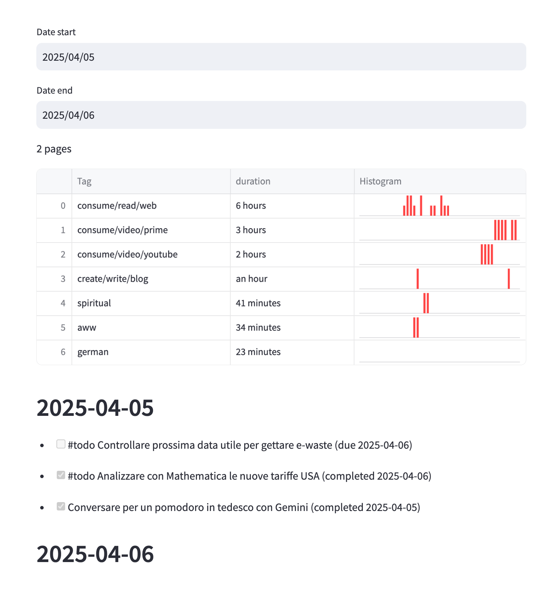

The code is organized according to the most fitting phase of the Observe-Orient-Direct-Act (OODA) loop.

1. **Observe:** Gather raw data from sensors or external sources.
2. **Orient:** Transform or interpret data into meaningful insights.
3. **Decide:** Determine the best course of action.
4. **Act:** Carry out decisions through actuators (e.g. notification, show info on a dashboard).

## Data store as a whiteboard

The data store acts as a whiteboard for multiple kinds of agents:

- **Observers** publish data.
- **Orienters** read raw data, aggregate or summarize it, and write back insights.
- **Deciders** read insights, generate decisions, and publish them.
- **Actuators** read decisions and execute actions.
